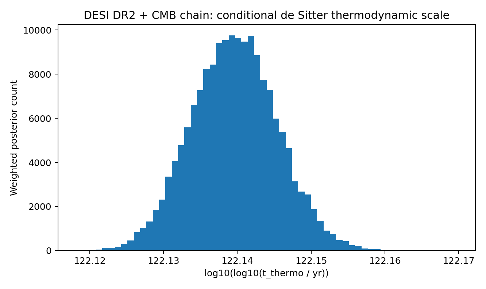
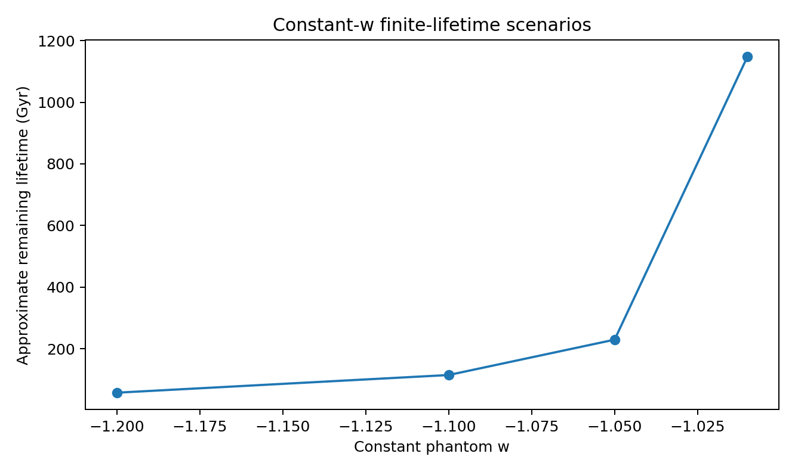
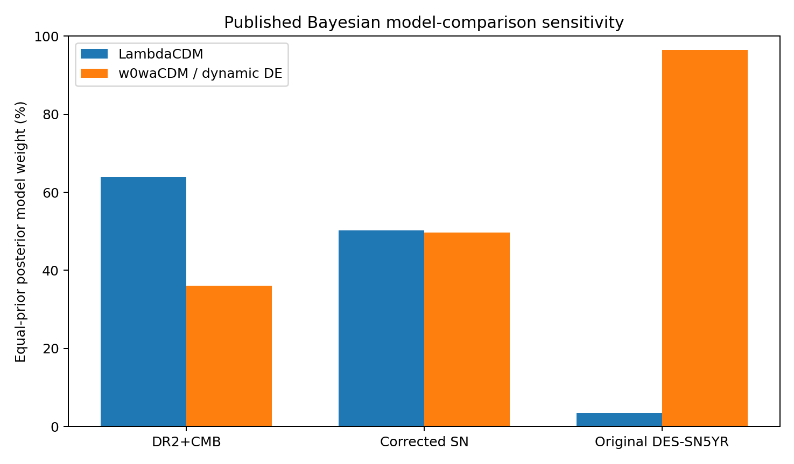
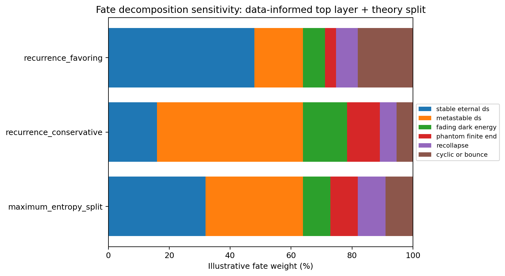
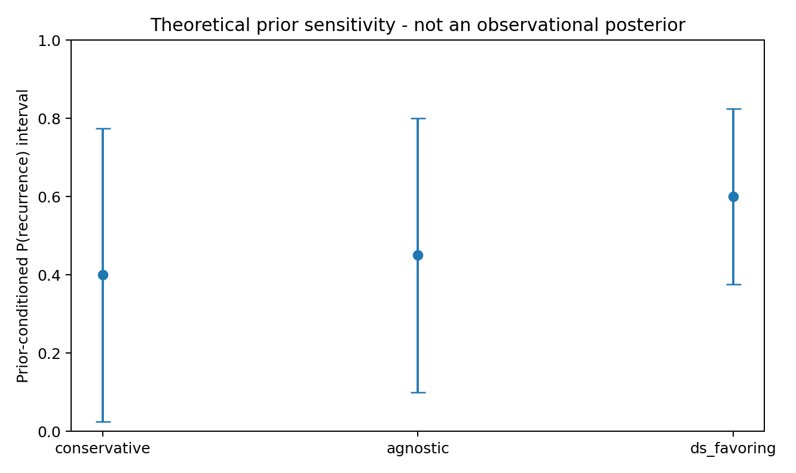
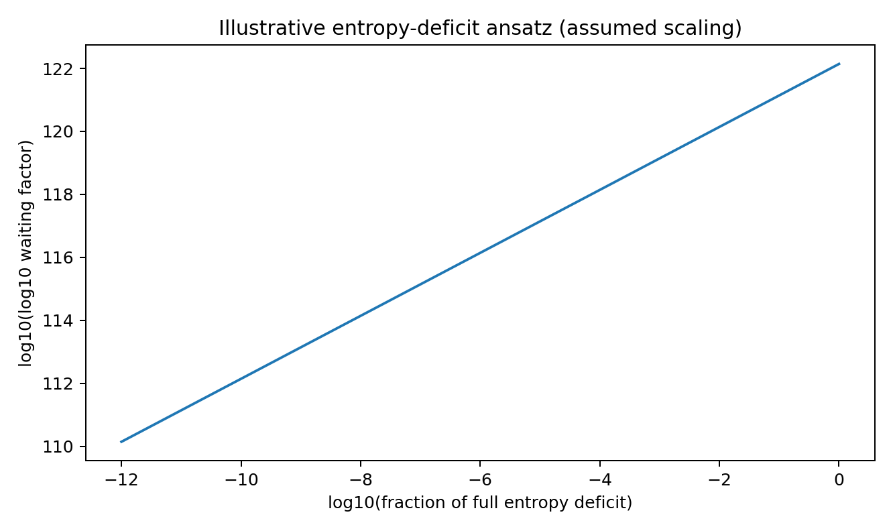

# Cosmological Recurrence Probability Study

**A Fate-Conditioned Partial-Identification Framework for Cosmological Recurrence**

The study - Publication Release  
Scott A. Sundy  
9 August 2026

# Research question

Given the universe we observe today, which physically viable futures permit recurrence, what timescale follows under each declared recurrence model, and what probability can be assigned after accounting for uncertainty in the universe's ultimate fate?

# Abstract

Cosmological recurrence is often reduced to a single spectacular timescale or an unsupported probability. This study instead treats it as a structured inference problem. It separates observational parameter uncertainty inside a specified cosmological model from uncertainty about the far-future cosmological branch and from additional quantum assumptions required for recurrence. It also distinguishes exact microscopic recurrence, near recurrence, causal-patch recurrence, macrostate recurrence, and observational recurrence.

For an eternal, stable, spatially flat positive-Lambda future, the Cosmic Coordinate reference point gives an asymptotic de Sitter horizon entropy S_dS/k_B = 3.18835 x 10^122. The conventional finite-patch thermodynamic estimate t_thermo ~ H_Lambda^-1 exp(S_dS/k_B) therefore gives log10(t_thermo/yr) = 1.38468 x 10^122. This quantity is a conditional entropy-exponential thermodynamic recurrence scale. It is not a computed epsilon-recurrence time for the observed universe.

The primary observational propagation uses the released DESI DR2+CMB flat-LambdaCDM Cobaya posterior rather than a Gaussian surrogate. The weighted posterior median is log10(t_thermo/yr) = 1.37911 x 10^122, with a 95% interval [1.34391 x 10^122, 1.41616 x 10^122]. This observational spread is negligible relative to uncertainty in the universe's ultimate fate and in the microscopic assumptions behind recurrence.

The study retains a data-informed model-family layer using the Ong, Yallup & Handley Bayesian reanalysis. The DESI DR2 BAO + Planck CMB baseline is ln B_dynamic/Lambda = -0.57 +/- 0.26; the corrected DES-Dovekie comparison uses the current reported value -0.01 +/- 0.27. With equal prior odds restricted to LambdaCDM and w0-wa CDM, the baseline corresponds to posterior model weights of 63.9% for LambdaCDM and 36.1% for dynamical dark energy. These are probabilities over a declared two-model set, not probabilities of specific ultimate fates.

The principal probability result is partial identification. Present observations do not determine the probability that dark energy remains a positive cosmological constant forever, the lifetime of our vacuum relative to recurrence, whether a de Sitter causal patch is described by a finite effectively closed Hilbert space, or whether any future bounce has recurrent dynamics. Without theoretical priors on those unknowns, the marginalized recurrence probability remains [0,1]. Because this is the full logical probability range, it is a non-identifiability result rather than an informative probability estimate. Narrower intervals are therefore reported only as prior-conditioned theoretical sensitivity analyses, never as measured cosmological probabilities.

## Key results

| Quantity | Result | Interpretation |

|---|---|---|

| Cosmic Coordinate de Sitter horizon time | 17.2105 Gyr | Model-conditional reference |

| Cosmic Coordinate de Sitter entropy | 3.18835 x 10^122 k_B | Model-conditional reference |

| CPS thermodynamic recurrence exponent | 1.38468 x 10^122 | Conditional thermodynamic scale; not epsilon recurrence |

| DESI DR2+CMB chain median exponent | 1.37911 x 10^122 | Weighted official posterior propagation under flat LambdaCDM |

| Equal-prior two-model weight: LambdaCDM | 63.9% | Published Bayesian evidence; only LambdaCDM vs w0-wa CDM |

| Equal-prior two-model weight: dynamical DE | 36.1% | Published Bayesian evidence; not an ultimate-fate probability |

| Data-only marginalized recurrence probability | [0,1] | Ultimate-fate/theory probabilities are not identified |

| Quantum epsilon recurrence | Not numerically identified for cosmology | Requires a finite discrete spectrum, energy span, trace distance, and epsilon |

# 1. Scope and scientific status

CRPS is a standalone cosmological study. Cosmic Coordinate is used only as a declared reference point for one flat matter+Lambda calculation. Recurrence Dynamics is not used to prove CRPS and is not incorporated into the cosmological inference. Its earlier exact-versus-near terminology is retained only where it improves clarity.

The principal observational input is the official DESI DR2 Results II flat-LambdaCDM posterior for all DESI DR2 BAO measurements combined with the default CMB likelihood set. The archive includes a compact projection of the four released Cobaya chains to the only fields required here: posterior weight, H0, and Omega_m. The source files are independently hash-verified against DESI's published checksum catalog.

DESI DR2 Results IV, released in July 2026, adds a Lyman-alpha Alcock-Paczynski/full-shape measurement and reports updated extended-model constraints. It strengthens the reason not to treat flat LambdaCDM as established far-future physics. CRPS therefore uses flat LambdaCDM only as a conditional branch for calculating the de Sitter horizon scale; it does not claim that current data establish an eternal cosmological constant.

# 2. Recurrence targets must be declared

The statement 'the universe recurs' is incomplete until the object being compared, the distance measure, and the tolerance are specified. CRPS separates the following targets.

| Target | Definition | Status in CRPS |

|---|---|---|

| Exact microscopic recurrence | Complete microscopic/quantum state returns exactly | Not inferred from cosmological data |

| Quantum near recurrence | Finite-system states return within trace distance epsilon | Theorem available; cosmological spectrum unknown |

| Causal-patch thermodynamic recurrence | Entropy-exponential fluctuation/return scale of an effectively finite de Sitter patch | Conditional calculable scale |

| Cosmological macrostate recurrence | Declared macroscopic variables return to a target region | Requires an explicit macrostate metric |

| Observational recurrence | Selected observables become indistinguishable within stated resolution | Requires a declared observable set and tolerances |

$$ R_epsilon(t): d[x(t), x(0)] <= epsilon $$

The study preserves the separation between the de Sitter thermodynamic clock and quantum epsilon recurrence, and adds a hierarchical fate-probability layer: observed data constrain top-level model-family weights, while unresolved within-family fate splits are exposed as explicit theory sensitivity assumptions rather than hidden inside a single percentage.

# 3. Fate-conditioned probability architecture

Let D denote present observations, M a far-future cosmological model, theta measured cosmological parameters within M, and A additional theoretical assumptions required for a recurrence theorem or mechanism. The target probability has the schematic form:

$$ P(R_epsilon < T | D) = sum_{M,A} integral P(R_epsilon < T | M, theta, A) p(theta, M, A | D) dtheta $$

Only part of this expression is presently data-driven. The posterior p(theta | M,D) can be propagated from released cosmological chains. The probabilities of the far-future models and quantum assumptions are not presently identified. CRPS therefore refuses to collapse them into a single measured percentage.

- Observational uncertainty: H0, Omega_m, and other parameters inside a declared cosmological model.

- Future-model uncertainty: eternal Lambda, metastable vacuum, fading dark energy, finite-time endpoint, recollapse, or cyclic/bounce behavior.

- Recurrence-theory uncertainty: finite effective state space, unitarity/closure, spectral structure, vacuum survival, and recurrent properties of any cycle map.

# 4. Physically distinct future branches

| Future branch | Recurrence status | What must additionally be true |

|---|---|---|

| Eternal positive Lambda / de Sitter | Permits a conditional thermodynamic recurrence argument | Finite/effectively closed recurrent patch interpretation |

| Metastable de Sitter | Possible only before vacuum decay | Vacuum survival must compete successfully with recurrence |

| Phantom finite-lifetime endpoint | No asymptotic de Sitter recurrence regime | Future really remains sufficiently phantom |

| Dark energy fades toward zero | No standard finite-patch guarantee | Asymptotic state-space/horizon structure must be specified |

| Recollapse without bounce | Contraction alone does not imply recurrence | A return map is required |

| Cyclic/bouncing future | Potentially recurrent | Cycle map itself must return or approach prior states |

| Spatial duplicates / eternal inflation | Excluded from target | A duplicate elsewhere is not temporal recurrence of this patch |

# 5. Eternal de Sitter thermodynamic branch

## 5.1 Horizon scale and entropy

$$ H_Lambda = H0 sqrt(Omega_Lambda) $$

$$ r_dS = c / H_Lambda $$

$$ S_dS/k_B = pi r_dS^2 / l_P^2 $$

At the Cosmic Coordinate reference point H0 = 68.11 km s^-1 Mpc^-1 and Omega_Lambda = 0.6958, CRPS obtains H_Lambda^-1 = 17.2105 Gyr, r_dS = 1.6282 x 10^26 m, and S_dS/k_B = 3.18835 x 10^122.

## 5.2 Conditional entropy-exponential recurrence scale

$$ t_thermo ~ H_Lambda^-1 exp(S_dS/k_B) $$

The scale is too large to construct directly. In logarithmic form, log10(t_thermo/yr) = 1.38468 x 10^122 and log10(log10(t_thermo/yr)) = 122.14135. The latter is only a compact plotting coordinate.

This is a conventional thermodynamic/Poincare estimate under a finite recurrent de Sitter-patch interpretation. It does not prove that the real universe remains de Sitter for this duration, that the global universe is finite, or that a cosmological causal patch satisfies the microscopic assumptions of a finite quantum recurrence theorem.

# 6. Official DESI DR2 posterior propagation

The primary propagation no longer samples a fitted Gaussian. It applies the de Sitter branch calculation to the official weighted DESI DR2+CMB Cobaya posterior. A Gaussian approximation is retained only as a reproducibility cross-check.

| Quantity | Median | 95% posterior interval |

|---|---|---|

| H0 (km s^-1 Mpc^-1) | 68.1728 | [67.6174, 68.7181] |

| Omega_m | 0.302655 | [0.295669, 0.309883] |

| H_Lambda^-1 (Gyr) | 17.1758 | [16.9552, 17.4050] |

| S_dS/k_B | 3.17551 x 10^122 | [3.09448 x 10^122, 3.26082 x 10^122] |

| log10(t_thermo/yr) | 1.37911 x 10^122 | [1.34391 x 10^122, 1.41616 x 10^122] |

| log10 log10(t_thermo/yr) | 122.13960 | [122.12837, 122.15111] |

The result is a scale-separation statement: current uncertainty in H0 and Omega_m shifts the enormous thermodynamic exponent only modestly, while a change in the far-future branch can remove the recurrence conclusion entirely.

# 7. Quantum epsilon recurrence is a different clock

Gupta and Short define finite-system quantum recurrence using trace distance. For a finite-dimensional unitary system with a finite discrete Hamiltonian spectrum, their continuous-time theorem gives an upper bound on the time at which all states return within epsilon, provided at least one state has moved farther than epsilon at an earlier time.

$$ T(rho(t_r), rho(0)) <= epsilon $$

$$ t_r <= [2 pi hbar / (E_max-E_min)] [2 ceil(pi/epsilon)]^(d-2) $$

This theorem is rigorous for the stated finite-system assumptions, but CRPS does not substitute de Sitter entropy into it. A cosmological numerical application would require, at minimum, a justified finite Hamiltonian description, the number d of distinct energy eigenvalues, and the energy span E_max-E_min. Those microscopic inputs are not identified by current cosmological data.

| Metric | epsilon | Cosmological numerical value | Reason |

|---|---|---|---|

| Trace distance | 0.1 | Not identified | Finite discrete spectrum and energy span are unknown |

| Trace distance | 0.01 | Not identified | Finite discrete spectrum and energy span are unknown |

| Trace distance | 0.001 | Not identified | Finite discrete spectrum and energy span are unknown |

The clean conclusion is therefore two-clock, not one-clock: CRPS can compute a conditional thermodynamic de Sitter scale, while a cosmological epsilon-recurrence time remains uncalculated pending microscopic input.

# 8. Metastable de Sitter: recurrence versus decay

If the universe approaches a de Sitter-like phase but the vacuum is metastable, recurrence competes with vacuum decay. Under constant independent hazards:

$$ P(recurrence before decay) = tau_decay / (tau_decay + t_rec) $$

A vacuum lifetime that is enormous by astrophysical standards can still be negligible compared with an entropy-exponential recurrence scale. CRPS therefore performs competing-hazard calculations in logarithmic space. It does not assign a decay lifetime because present cosmological data do not measure the relevant microscopic vacuum-decay rate.

# 9. Finite-lifetime phantom scenarios

A constant equation of state w<-1 produces a finite future proper time in the standard late-time approximation:

$$ Delta t ~= 2 / [3 |1+w| H0 sqrt(Omega_DE)] $$

| Constant w | Approximate remaining lifetime | Status |

|---|---|---|

| -1.01 | 1,147.4 Gyr | Scenario example only |

| -1.05 | 229.5 Gyr | Scenario example only |

| -1.10 | 114.7 Gyr | Scenario example only |

| -1.20 | 57.4 Gyr | Scenario example only |

These examples illustrate why a finite future endpoint and an eternal de Sitter recurrence branch are qualitatively different hypotheses. Current evidence for evolving dark energy does not by itself determine a Big Rip or any other specific endpoint.

# 10. Recollapse, bounce, and cyclic futures

A Big Crunch does not by itself imply recurrence. Contraction is not a time-reversal operator, and a bounce is not automatically a reset. A genuinely recurrent cyclic model needs an explicit cycle-to-cycle map whose dynamics return to, or approach, a prior state under a declared metric.

$$ x_{n+1} = F(x_n) $$

Temporal recurrence then becomes a property of iterates of F, not a consequence of the word 'cycle'. Dissipation, entropy production, particle creation, phase changes, or hidden degrees of freedom can prevent state return even if the scale factor oscillates.

# 11. Probability result: what is and is not identified

If the branch weights and the recurrence-theory probabilities are allowed to vary over everything consistent with current observations, the marginalized recurrence probability can range from zero to one. The current-data-only result is therefore:

$$ P(recurrence | current observations, unrestricted future theory) in [0,1] $$

This is the formal consequence of an underidentified problem, not an informative probability estimate. Observations constrain the recent and intermediate expansion history; they do not yet identify the full dark-energy potential, vacuum lifetime, microscopic de Sitter state space, or a future cycle map. The full [0,1] interval means the target is non-identified under unrestricted future theory; it does not assign equal plausibility to every value.

# 12. Bayesian model-family weights

A probability-like quantity can be introduced at the model-family level if the model set and prior odds are declared. CRPS adopts, as a transparent baseline, the 2026 Bayesian reanalysis by Ong, Yallup, and Handley for DESI DR2 BAO + Planck CMB. For the restricted two-model comparison LambdaCDM versus w0-wa CDM, the published ln Bayes factor is -0.57 +/- 0.26 in favor of the dynamical model relative to LambdaCDM. With equal prior odds this maps to normalized posterior model weights.

| Data combination | LambdaCDM weight | Dynamical-DE weight | Status |

|---|---|---|---|

| DESI DR2 + CMB | 63.9% | 36.1% | baseline |

| DESI DR2 + CMB + corrected DES-Dovekie SN | 50.2% | 49.8% | current calibration-corrected Bayesian comparison |

| DESI DR2 + CMB + original DES-SN5YR | 3.5% | 96.5% | calibration-sensitive historical comparison; not adopted as baseline |

These weights are conditional on the selected model set, prior odds, likelihood construction, and data combination. They are not direct probabilities that the universe ends in a Big Rip, Big Crunch, eternal de Sitter state, or cyclic future. DESI DR2 Results IV reports a 2.7 sigma frequentist preference for w0-wa over LambdaCDM for DESI+CMB, illustrating that frequentist fit significance and Bayesian model probability answer different questions.

# 13. Fate-probability decomposition

To make ultimate-fate uncertainty visible, CRPS decomposes the baseline top-level model weights into six named futures. The split within each model family is not observationally identified, so three explicit sensitivity maps are supplied rather than one claimed forecast. The maximum-entropy split is a neutral bookkeeping choice, not a physical principle.

| Future | Illustrative weight | Recurrence interpretation |

|---|---|---|

| Stable eternal de Sitter | 31.9% | Conditional de Sitter recurrence route exists if finite recurrent-patch assumptions hold |

| Metastable de Sitter | 31.9% | Competes with vacuum decay; decay lifetime unknown |

| Fading dark energy | 9.0% | Standard de Sitter recurrence argument does not transfer automatically |

| Phantom finite end | 9.0% | Finite endpoint; standard de Sitter thermodynamic route is effectively unavailable |

| Recollapse | 9.0% | Crunch alone does not imply recurrence |

| Cyclic/bounce | 9.0% | Potentially recurrent only if the cycle map returns states |

Under the maximum-entropy bookkeeping split, the numerical weights are about 31.9% stable eternal de Sitter, 31.9% metastable de Sitter, and 9.0% each for fading dark energy, a phantom finite end, recollapse, and a cyclic/bounce future. The study does not privilege those six numbers as truth; their purpose is to show exactly how the answer moves when unresolved theory assumptions are changed.

# 14. Prior-conditioned recurrence sensitivity

For illustration only, CRPS retains three prior scenarios. Each scenario supplies both weights over future branches and a theoretical support parameter for the recurrent finite-patch assumptions conditional on eternal de Sitter. These are not observational posterior probabilities.

| Prior scenario | p(recurrent patch | eternal dS) | Conditional recurrence interval |

|---|---|---|

| conservative | 0.25 | [0.025, 0.775] |

| agnostic | 0.50 | [0.100, 0.800] |

| ds_favoring | 0.75 | [0.375, 0.825] |

# 15. Finite-horizon probabilities and numerical precision

For a stationary rare-event model with mean wait t_thermo, P(T)=1-exp(-T/t_thermo). For T much smaller than t_thermo, log10 P is approximately log10 T - log10 t_thermo. A naive ordinary floating-point subtraction can cause many different horizons to print identically because their corrections are microscopic compared with a 10^122-scale exponent; the implementation therefore preserves the subtraction in a numerically stable representation.

The study stores the rare-event subtraction with high-precision decimal arithmetic and also records the horizon exponent as a fraction of the recurrence exponent. This fixes the representation problem without pretending that the physical probabilities are meaningfully large.

# 16. Entropy-deficit ansatz

CRPS retains an illustrative macrostate ansatz, Delta S=f S_dS and t~H^-1 exp(Delta S), only to visualize sensitivity to a chosen entropy deficit. The linear relationship seen after taking double logarithms is a mathematical consequence of the assumed equation. It is not empirical evidence, and there is no derived mapping here from trace-distance epsilon to f.

# 17. What current observations actually tell us

| Finding | Defensible interpretation |

|---|---|

| Flat LambdaCDM permits a precise conditional de Sitter entropy calculation | Useful branch calculation; not proof of the far future |

| DESI posterior uncertainty barely changes the qualitative thermodynamic recurrence scale | Parameter uncertainty is secondary |

| Published Bayesian DESI DR2+CMB comparison gives roughly 64% LambdaCDM vs 36% w0-wa CDM under equal prior odds | Useful model-family weight; not a fate probability |

| Recent DESI analyses continue to test evolving dark energy | Far-future extrapolation remains structurally uncertain |

| Finite quantum recurrence theorems require explicit microscopic inputs | Entropy alone is not a substitute for epsilon and spectrum |

| Vacuum decay or finite future endpoints can preempt recurrence | Ultimate-fate physics dominates |

| A crunch or bounce does not automatically recreate the same state | Cycle-map dynamics must be specified |

| The theory-agnostic marginalized probability is [0,1] | No unique current recurrence percentage is identified |

# 18. Limitations

- The de Sitter entropy argument is branch-conditional and does not establish a finite Hilbert-space interpretation of quantum gravity in de Sitter space.

- The thermodynamic recurrence scale is a heuristic/thermodynamic scale, not a rigorous system-specific first-return distribution for cosmology.

- The finite-system epsilon-recurrence theorem is not numerically instantiated for the universe because the necessary Hamiltonian spectrum is unknown.

- The DESI posterior propagation assumes the flat-LambdaCDM branch for that calculation; extended dark-energy models are not extrapolated into the remote future without a physical potential.

- The Big Rip calculations are constant-w scenarios, not forecasts from the current w0-wa phenomenology.

- The Bayesian model-family weights are conditional on a restricted two-model set and equal prior odds; they do not exhaust dark-energy theory space.

- The fate-decomposition percentages combine data-informed top-level model weights with explicit within-family theory splits and therefore are not observationally measured ultimate-fate probabilities.

- The prior-conditioned probability intervals are sensitivity demonstrations. Their branch weights and recurrent-patch support parameters are theoretical inputs.

- Spatial duplicates elsewhere in an infinite or inflating spacetime are not counted as temporal recurrence of our causal history.

# 19. Update pathways

CRPS is designed to narrow only when new information actually identifies one of its currently free components. High-value updates include:

- new DESI full-survey dark-energy posterior products and independent expansion-history measurements;

- a fundamental dark-energy model with a controlled far-future potential rather than a phenomenological fit alone;

- a quantitative vacuum-decay lifetime applicable to our vacuum;

- a quantum-gravity result establishing or rejecting an effectively finite de Sitter state space;

- a microscopic cosmological Hamiltonian or effective spectrum sufficient to evaluate an epsilon-recurrence theorem;

- a concrete cyclic/bounce model with an explicit return map and recurrence metric.

# 20. Conclusion

The universe may admit recurrence under some physically viable futures, but current observations do not tell us that it will recur. Under an eternal, stable, positive-Lambda future and the conventional finite recurrent causal-patch interpretation, the thermodynamic return scale is roughly 10^(1.38 x 10^122) years in the parameter region favored by current flat-LambdaCDM fits. That number is conditional, not a countdown.

The strongest result of CRPS is the uncertainty decomposition. At the data-informed model-family level, one published equal-prior Bayesian comparison assigns about 63.9% weight to LambdaCDM and 36.1% to w0-wa CDM for DESI DR2+CMB. But those weights still do not determine vacuum stability or the remote fate of dynamical dark energy. Observational uncertainty in H0 and Omega_m is already small compared with those structural uncertainties. A defensible study therefore reports model-family weights, conditional scales, and explicit theory sensitivity instead of a fabricated universal recurrence percentage.

Accordingly, the current theory-agnostic marginalized recurrence probability remains the full [0,1] logical bound, a non-identifiability result. Narrower values become meaningful only after the assumptions that produce them are supplied and defended.

# References

1. DESI Collaboration / M. Abdul Karim et al. (2025). DESI DR2 Results II: Measurements of Baryon Acoustic Oscillations and Cosmological Constraints. Physical Review D 112, 083515. arXiv:2503.14738.

2. DESI Collaboration (2025-2026). DESI DR2 BAO cosmology products and public Cobaya chains. DESI Data portal.

3. DESI Collaboration (2026). DESI DR2 Results IV: Alcock-Paczynski Measurements from the Lyman Alpha Forest and Cosmological Constraints. arXiv:2607.27410v3.

4. Ong, D. D. Y., Yallup, D., & Handley, W. (2026). The Bayesian view of DESI DR2 with unimpeded: Evidence and tension in a combined analysis with CMB and supernovae across cosmological models. arXiv:2603.05472.

5. Gupta, C., & Short, A. J. (2026). Recurrence Time for Finite Quantum Systems. arXiv:2604.14995v2. Journal metadata omitted here because the arXiv-listed journal DOI currently conflicts with the APS record.

6. Gibbons, G. W., & Hawking, S. W. (1977). Cosmological event horizons, thermodynamics, and particle creation. Physical Review D 15, 2738.

7. Dyson, L., Kleban, M., & Susskind, L. (2002). Disturbing Implications of a Cosmological Constant. JHEP 10 (2002) 011. arXiv:hep-th/0208013.

8. Goheer, N., Kleban, M., & Susskind, L. (2003). The Trouble with de Sitter Space. JHEP 07 (2003) 056. arXiv:hep-th/0212209.

9. Caldwell, R. R., Kamionkowski, M., & Weinberg, N. N. (2003). Phantom Energy and Cosmic Doomsday. Physical Review Letters 91, 071301. arXiv:astro-ph/0302506.

10. Sundy, S. A. (2026). Cosmic Coordinate. Declared reference artifact.

11. Sundy, S. A. (2026). Recurrence Dynamics Study . Terminology reference only; not incorporated into CRPS.

# Appendix A. Reproducibility and provenance

The repository includes the exact configuration, source code, compressed DESI posterior projection, source-chain hashes, numerical outputs, figures, and 38 automated tests. `python run.py` regenerates all numerical CSV outputs and figures from `config.json`. `python -m pytest` validates the core equations, weighted posterior machinery, input validation, probability bounds, finite-horizon precision behavior, and bundled observational projection.

The DESI projection contains 59,891 source rows with summed Cobaya weight 169,444. The four source chain SHA-256 hashes and official directory are recorded in `data/desi-source.md`; `scripts/fetch_desi.py` independently rebuilds the projection after verifying those hashes.

# Appendix B. Interpretation rules

- Never report a near recurrence as exact recurrence.

- Never call the de Sitter entropy-exponential thermodynamic scale an epsilon-recurrence time without a declared microscopic model, metric, and tolerance.

- Never interpret a spatial duplicate as temporal recurrence.

- Never treat a w0-wa fit as a guaranteed far-future law without an explicit physical extrapolation model.

- Never replace an unidentified probability with 0.5 merely because it is unknown.

- Never present the prior-sensitivity scenarios as observational posterior probabilities.

- Always separate observational parameter uncertainty from far-future model and recurrence-theory uncertainty.

# Appendix C. Data acknowledgment

This study uses public DESI cosmological posterior data. CRPS is independent work and is not an official DESI analysis or endorsement. The repository directs downstream users to the current DESI data-license and acknowledgment requirements in `ACKNOWLEDGMENTS.md` and `data/desi-source.md`.
